# Step by Step Cuckoo Installation for anyone.
This is intended to help you install the Cuckoo as easy as possible.
## My Enviroment
1. Windows 10 Host.
2. VirtualBox 6.1.0 for windows (You can download it from [here](https://download.virtualbox.org/virtualbox/6.1.0/VirtualBox-6.1.0-135406-Win.exe)).
3. Ubuntu 18.04 Desktop ISO ( You can download it from [here](https://ubuntu.com/download/desktop/thank-you?version=18.04.3&architecture=amd64)).
4. Virtual that will host the Cuckoo with specs - Disk:100 GB, RAM 8 GB and 4 vCPU.
5. VitualBox 5.2.34 for Linux - Ubuntu 18.04 (Installation will come later in this guide).
6. Windows 7 ISO (Bring your own :)) will be used for the Victim machine. You can download an OVA from [Microsoft](https://developer.microsoft.com/en-us/microsoft-edge/tools/vms/).

## Assumptions:
1. You can install Virtualbox on your host, doesn't matter Windows or Linux as this guide cares more about the newly created Virtual Machine within.  
2. You Create your own virtual machine that will host Cuckoo.
3. You Can Install Ubuntu 18.04 on your new virtual machine, create a username "cuckoo" during the installation to ease things.

# Let's begin
The next part is all about preparing the environment  for the cuckoo installation
Start with installing Virtualbox then create the Virtual machine and build your Ubuntu 18.04 machine.

## VirtualBox Guest additions CD Installation
Install Guest additions to make your life easier and so you can copy/paste commands from here to you VM.

1. From your Virtual Machine, select "Devices" and then "Insert Guest Additions CD image…".

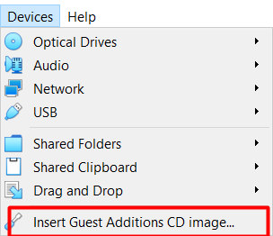

2. It will mention that it contains software, click "Run Software".

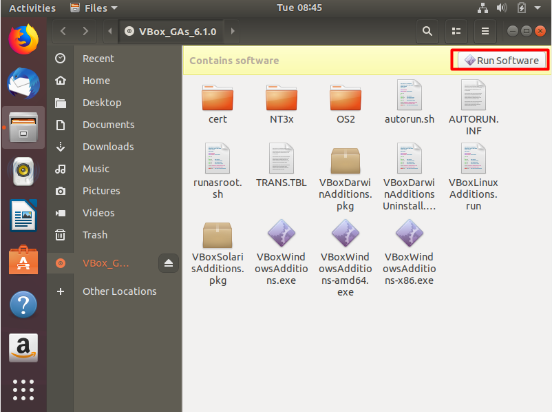

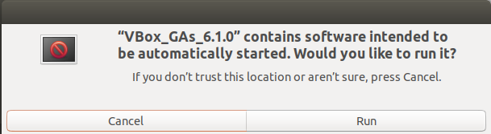

3. Guest Addition CD will start installation "It will ask for your account 'cuckoo' password".     
     
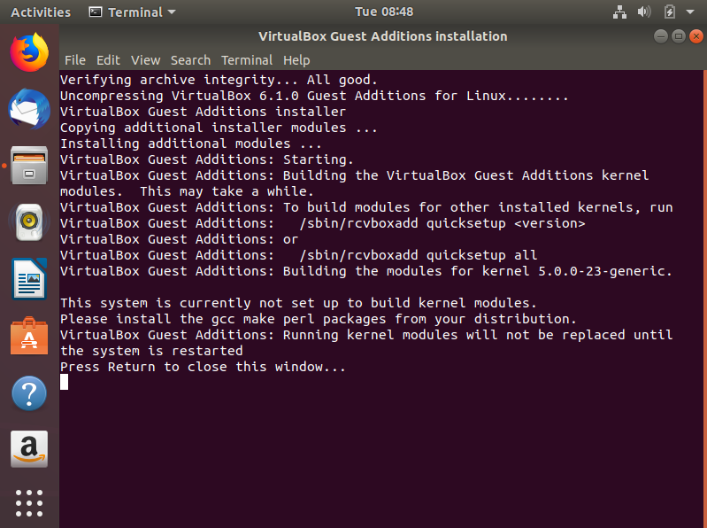

4. Reboot the ubuntu VM in order for the installation to take effect.
5. Now set "Shared Clipboard" to "Bidirectional", again from devices.     

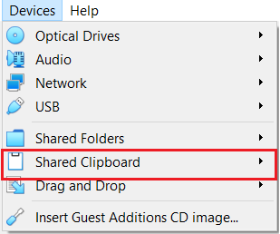

6. When the VM is still powered off, make sure that "Enable Nested VT-x/AMD-v" is checked, so you are able to create the nested Virtual machine ( Victim ) as 64-bit, otherwise, only 32-bits options will be available.

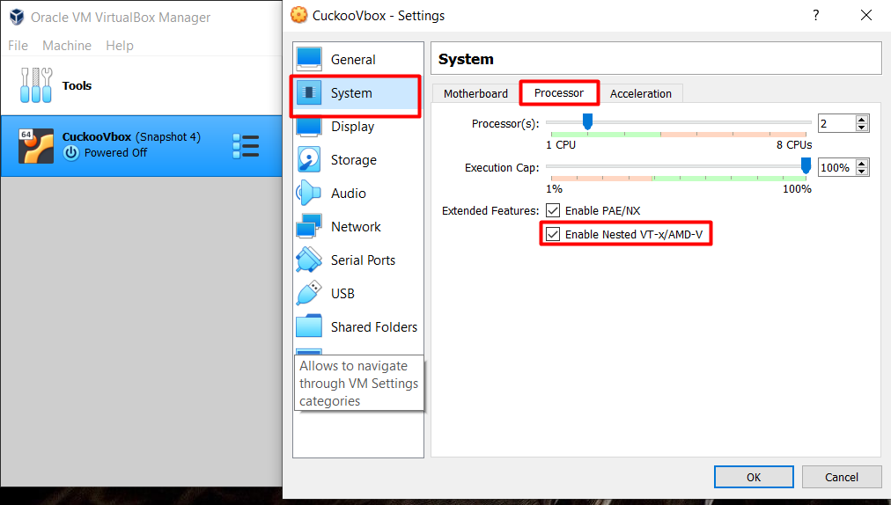

Note: If the option is dimmed (greyed-out), check the [Known issues](#known-issues) section.

**_Now, the VirtualBox and Ubuntu machine are ready to start._**

# Cuckoo preparation
## Python packages, Pydeep and tcpdump
Cuckoo is completely written in Python, We have to make sure that everything is in place, so we don't run into issues later.

### 1. First thing first, Let's download package information from all configured sources.   
`sudo apt-get update`      
If this failed, check the [Known Issues](#known-issues) section.     

### 2. The below are needed to install Python and other dependencies that will be needed later.
`sudo apt-get install git mongodb libffi-dev build-essential python-django python python-dev python-pip python-pil python-sqlalchemy python-bson python-dpkt python-jinja2 python-magic python-pymongo python-gridfs python-libvirt python-bottle python-pefile python-chardet tcpdump libssl-dev python-virtualenv python-setuptools libjpeg-dev zlib1g-dev swig -y`

**This step will take few minutes, you can go grab a drink meanwhile-No worries, I will wait.**

### 3. Install Pydeep, that depends on ssdeep  
   ```bash
   wget http://sourceforge.net/projects/ssdeep/files/ssdeep-2.13/ssdeep-2.13.tar.gz/download -O ssdeep-2.13.tar.gz  
   tar -zxf ssdeep-2.13.tar.gz   
   cd ssdeep-2.13   
   ./configure   
   make  
   sudo make install   
```
##### Validate your ssdeep installation using `ssdeep -V` you should see `2.13`
   g. Install Pydeep `pip install pydeep`   
   h. Validate pydeep installation using `pip show pydeep`   

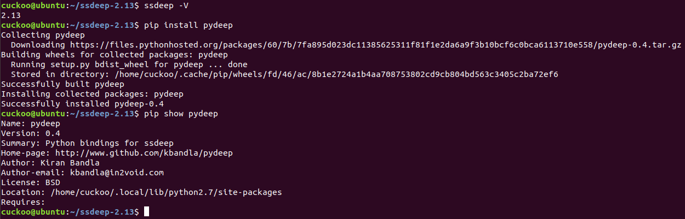   


### 4. Now we need to configure the tcpdump so we can use it with our non-root account     
   ```bash
   cd #to go back to your home directory
   sudo groupadd pcap   
   sudo usermod -a -G pcap cuckoo   
   sudo chgrp pcap /usr/sbin/tcpdump   
   sudo setcap cap_net_raw,cap_net_admin=eip /usr/sbin/tcpdump    
   sudo apt-get install -y apparmor-utils
   sudo apt-get install snap-confine       
   sudo aa-disable /usr/sbin/tcpdump
   ```     
##### Verify using `getcap /usr/sbin/tcpdump`    
   ```bash
   sudo apt-get install libcap2-bin to install setcap # it should be already installed, I left it here just in case  
   ```    
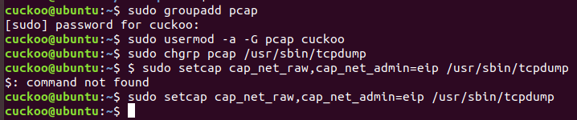   

### 5. Time for Yara.      
   ```bash
   sudo apt-get install autoconf libtool libjansson-dev libmagic-dev libssl-dev -y      
   wget https://github.com/plusvic/yara/archive/v3.4.0.tar.gz -O yara-3.4.0.tar.gz   
   tar -zxf yara-3.4.0.tar.gz   
   cd yara-3.4.0    
   ./bootstrap.sh   
   ./configure --with-crypto --enable-cuckoo --enable-magic    
   sudo apt install libssl1.0-dev -y # in other ubuntu versions this step might not be needed , but on 18.04 libssl-dev defaults to 1.1. otherwise the _"make"_ command will fail    
   make   
   sudo make install  
   ```
   ##### Validate Yara installation `yara -v`, you should see `yara 3.4.0`    
   ```bash
   cd yara-python   
   python setup.py build     
   sudo python setup.py install 
   ```   
##### Validate yara-python installation using `pip show yara-python`     


### 6. Volitality
```bash
cd # to go back to your home directory
pip install openpyxl   
pip install ujson 
pip install pycrypto   
pip install distorm3   
pip install pytz
git clone https://github.com/volatilityfoundation/volatility.git
cd volatility
python setup.py build  
sudo python setup.py install
```   
##### Validate using the `python vol.py -h` this should list the help menu      


### 7. M2Crypto Install    
 ```bash
 cd # to go back to your home directory 
 sudo apt-get install swig #Should be already installed       
 sudo pip install m2crypto==0.24.0
```
# Almost ready for Installing the Cuckoo. 
## Let's Prepare the Victim Machine.
### 8. VirtualBox Installation
```bash
sudo add-apt-repository multiverse && sudo apt-get update
sudo apt-get install virtualbox -y
sudo usermod -a -G vboxusers cuckoo
```
### Now It's your turn, Install the Victim machine.
a. Run `virtualbox` to start the virtualbox-obviosly :)        
b. Create a Virtualmachine and name it "victimwin7" - Make sure it is a 64-bit, If you can't find the option for a 64-bit check the [Known Issues](#known-issues) section.      
c. Install Windows 7.    

**_To copy the Windows ISO from your host to the Ubuntu VM_:**

a. Create a directory on your host and add the ISO    
b. From the VirtualBox Devices -> Shared Folders->  Shared Folders Settings     
c. Add a Transient Folder and browser to the directory, check Read-Only and Automount.     
d. A directory will be created on your Desktop ( it may ask you for your password )     
e. Copy the ISO to any location (Not Desktop) on your ubuntu machine.    

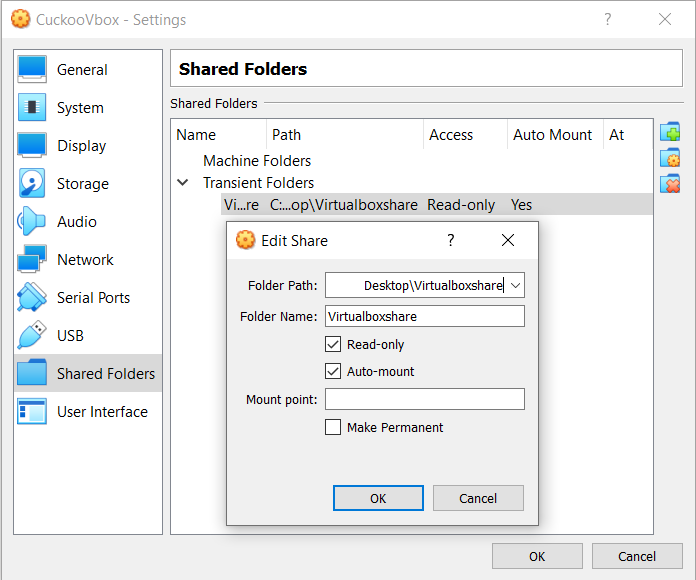     

f. Start installing your victimwin7 machine.    
g. Create user "cuckoo" with no password and adjusted the timezone   
h. Install The Guest Additions ( Make sure to uninstall it once completed the setup, I will remind you later)     

**My turn, I will go grab a drink**   

**_Let's leave this victimwin7 machine for now and we will get back to it later_**    

From your Ubuntu machine run the below commands to create hostonly interface and to isolate the guest machine from the network. ( Guest - Victimwin7- Machine needs to be powered off)
```bash
vboxmanage hostonlyif create 
vboxmanage modifyvm "victimwin7" --hostonlyadapter1 vboxnet0    
vboxmanage modifyvm "victimwin7" --nic1 hostonly     
```
You Might need to check the [Known Issues](#known-issues) and the [Bonus](#bonus) and come back     

## We need to configure iptables to control the traffic and forward traffic to the internet.

Run : `ip addr ` command to know your interfaces names and assigned IPs.   
In my case:
1. enp0s17: 10.0.2.15/24   ( Ubuntu Guest VM)     
2. vboxnet0: 192.168.56.1/24 ( Virtual Interface that will communicate with the victim machine)    
```bash
sudo apt-get install iptables-persistent -y    
sudo iptables -A FORWARD -o enp0s17 -i vboxnet0 -s 192.168.56.0/24 -m conntrack --ctstate NEW -j ACCEPT    
sudo iptables -A FORWARD -m conntrack --ctstate ESTABLISHED,RELATED -j ACCEPT    
sudo iptables -A POSTROUTING -t nat -j MASQUERADE   
sudo sysctl -w net.ipv4.ip_forward=1   
sudo iptables-save > /etc/iptables/rules.v4    
```
_if you run into permission denied error in the 'iptables-save' command  do:_ 

```bash
sudo su -    
iptables-save > /etc/iptables/rules.v4   
exit
```   
# Our Guest host (victimwin7) Configuration.     

## Network:    
    
Configure the network on windows machine, since the Ubuntu host has IP 192.168.56.1, we need to configure the windows in the same subnet.     

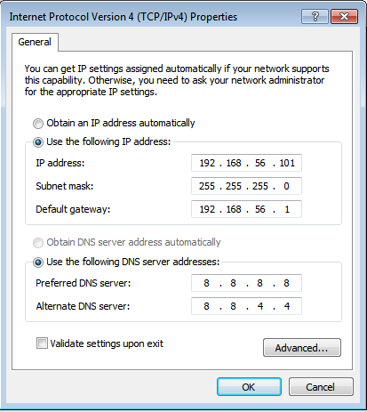      
_Notice the Default Gateway, should be the same as Ubuntu virtual interface (vboxnet0 ) IP_

## Let's make the windows machine as vulnerable as possible.

1. Click Start > Control Panel > System and Security > Turn automatic updating on or off. In the Important updates menu, select Never check for updates. Deselect Give me recommended updates the same way I receive important updates

2. Disable UAC:     

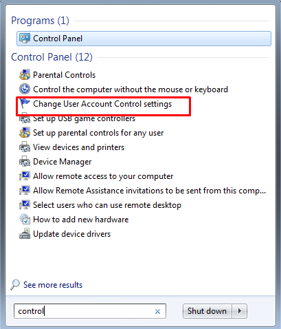     
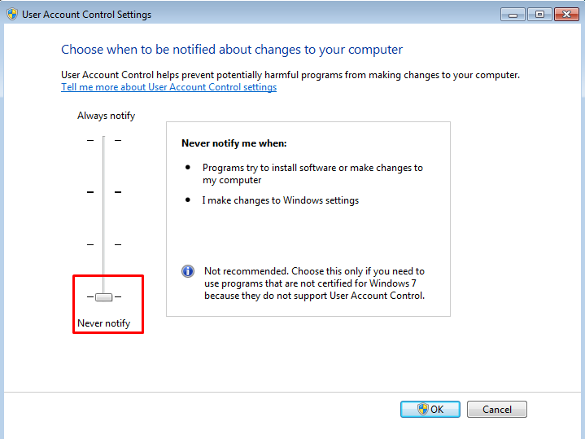     

3. Disable Firewall:     

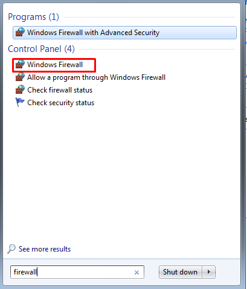       
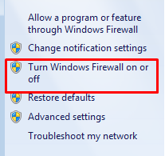     
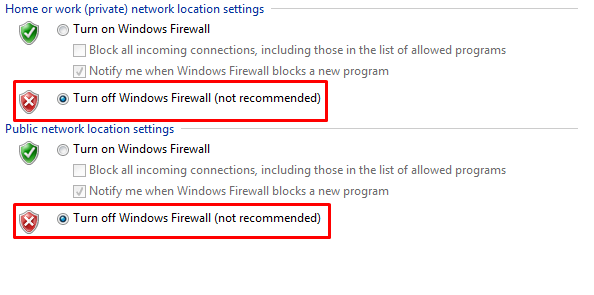     

## Install the below softwares.
1. Adobe Reader
2. Adobe Flash Player
3. Microsoft office
4. Java
5. Python 2.7 for Windows **( Mandatory )** (https://www.python.org/ftp/python/2.7.13/python-2.7.13.msi) ( sometimes I am not able to download it directly from the victim machine, just download it from anywhere, copy it using the shared folder and then install it - _check next step_ )

## Share folder between Host ( ubuntu ) and Guest ( victimwin7 )

1. Follow same steps as mentioned earlier.
2. `net use x: \\vboxsvr\sharename`  Replace `sharename` with the name you chose in  from step 1.

# I think it's time to install the Cuckoo - Finally!
```bash
cd # to be back to your home directory    
pip install -U pip setuptools
sudo -H pip install -U cuckoo # this installs latest stable version that will change over time 
```
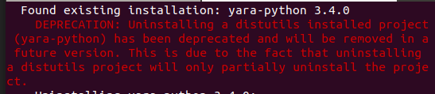  
_Ignore the above error if you see it_   
         
4.  Run `cuckoo` one time to create default directories          
 A directory with the name .cuckoo should be created in your home directory        
 ##### Validate using `ls -ld /home/cuckoo/.cuckoo`       

5. copy the file `/home/cuckoo/.cuckoo/agent.py` to the shared folder then copy to `C:\Users\%USERNAME%\AppData\Roaming\Microsoft\Windows\Start Menu\Programs\Startup` on the victimwin7.     

##### Validate by rebooting the guest victimwin7 machine, After the reboot you should see,           
 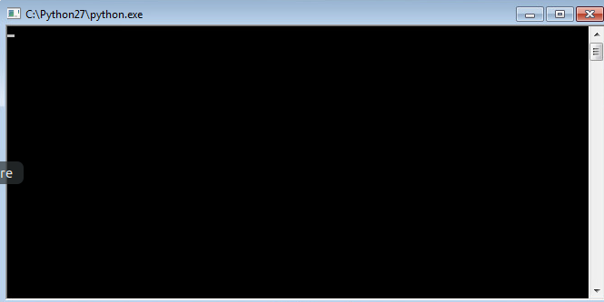       

 6. Remove shared Folder, and uninstall Guest additions from the victimwin7 machine **( Some malwares detect it's sandbox from the installed softwares).**
 7. Take a snapshot from the victimwin7 machine from ubuntu terminal:                     
   ```bash
   vboxmanage snapshot "victimwin7" take "snapshot1" --pause     # Note the snapshot name, will be used later        
   vboxmanage controlvm "victimwin7" poweroff      
   vboxmanage snapshot "victimwin7" restorecurrent
   ``` 
   d. Open the virtualbox, you will find the status as "saved" click on Discard.    
   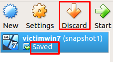          
       

## Almost done       

## Let's configure the Cuckoo       
_Few files in cuckoo need to be properly configured to have cuckoo work._

1. Cuckoo.conf        
     * 1.1. Location : /home/cuckoo/.cuckoo/conf/cuckoo.conf     
     * 1.2. Modifications:      

   ```bash    
   memory_dump = yes         
   machinery = virtualbox          
   Under [resultserver]     
   ip = 192.168.56.1 # ubuntu machine IP            
   ```
2. auxiliary.conf       
     * 2.1. Location: /home/cuckoo/.cuckoo/conf/auxiliary.conf       
     * 2.2. Modifications: 

   ```
   Under [sniffer]      
   enabled = yes                 
   tcpdump = /usr/sbin/tcpdump         
   ```
3. virtualbox.conf       
    3.1. Location: /home/cuckoo/.cuckoo/conf/virtualbox.conf        
    3.2. Modifications:

   ```    
   [virtualbox]:       
   mode = gui        
   machine = victimwin7             
   ```

   ```bash  
   Replace [cuckoo1] with [victimwin7]               
   label =  victimwin7          
   ip = 192.168.56.101             
   snapshot = snapshot1  # from earlier step                  
   ```
4. reporting.conf    
   * 4.1. Location: /home/cuckoo/.cuckoo/conf/reporting.conf      
   * 4.2. Modifications:              
   ```
   Under [mongodb]        
   enable = yes      
   ```

# MOMENT OF TRUTH...   

1. Open a new terminal and run `cuckoo`     
2. Open another terminal and run `cuckoo web runserver 0.0.0.0:8000`      
3. Open the browser and enter `127.0.0.1:8000`     

# Congratulations ...  
You have completed your CUCKOO installation   

***_Some issues I hit during creating this guide, so I wanted to document_***   

# Known Issues   
1. Option to enable "Enable Nested VT-x/AMD-v" is dimmed.

If you are on windows: Open CMD and `cd` to the VirtualBox installation folder and type,    
`VBoxManage modifyvm YourubuntuVMName --nested-hw-virt on`     

If you are on Linux: run the comamnd,    
`VBoxManage modifyvm YourubuntuVMName --nested-hw-virt on`

2. vboxnet0 interface disappears after reboot.         
         a. Either Start you victimwin7 machine once and then power it off.       
         b. Recreate the vboxnet0 interface and mentioned earlier in this guide.    
         c. Check the [Bonus](#Bonus)

3. apt-get fails to resolve.

This normally happens when /etc/resolv.conf doesn't contain a DNS server configured.
Follow the below to fix.

`vi /etc/resolv.conf`
add line,
`nameserver 8.8.8.8` or any other DNS server you have/know


# Bonus
To enforce VirtualBox vboxnet0 network interface to initialize after every reboot follow the below steps.

1. Create the `/opt/systemd` directory and create the bash script to run the vboxmanage commands.

```bash
sudo mkdir /opt/systemd/
sudo vim /opt/systemd/vboxhostonly
```
2. Copy in the text below and save with vi (hit esc key and type “:wq” and hit enter)

```bash
#!/bin/bash
vboxmanage hostonlyif create
vboxmanage hostonlyif ipconfig vboxnet0 --ip 192.168.56.1
```
3. Go to the directory where you saved the vboxhostonly file and make the file executable

```bash
 chmod +x /opt/systemd/vboxhostonly
```
4.  Next create the `vboxhostonlynic.service` file in `/etc/systemd/system/` directory

```bash
sudo touch /etc/systemd/system/vboxhostonlynic.service
```
5. Open the created file for edit.

```bash
vi /etc/systemd/system/vboxhostonlynic.service
```
and paste the below text

```bash
Description=Setup VirtualBox Hostonly Adapter
After=vboxdrv.service


[Service]
Type=oneshot
ExecStart=/opt/systemd/vboxhostonly


[Install]
WantedBy=multi-user.target
```
6. Now install the systemd service and enable it so it will be executed at boot time

```bash
systemctl daemon-reload
systemctl enable vboxhostonlynic.service
```
7. Verify the service is working properly

```bash
systemctl status vboxhostonlynic.service
```
If not started, run the below to start    

```bash
systemctl start vboxhostonlynic.service
```


#### I am done, but I have to give credit to the authors of the links who helped me install my first Cuckoo :) 

[Hero 1](https://gist.github.com/braimee/bf570a62f53f71bad1906c6e072ce993)     
[Hero 2](https://medium.com/@warunikaamali/cuckoo-sandbox-installation-guide-d7a09bd4ee1f)     
[Hero 3](https://cuckoo.sh/docs/installation/)    
[Hero 4](https://precisionsec.com/virtualbox-host-only-network-cuckoo-sandbox-0-4-2/)    

# Thank you, and I hope it was a smooth installation 